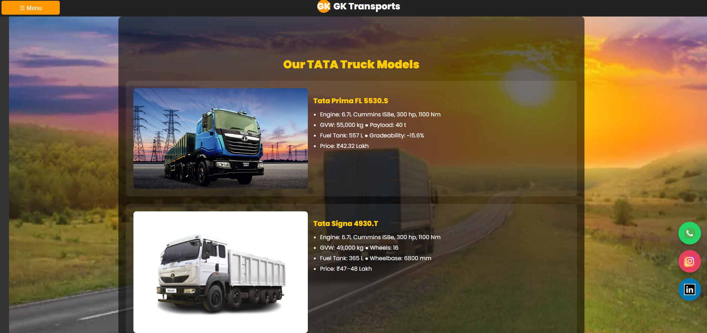
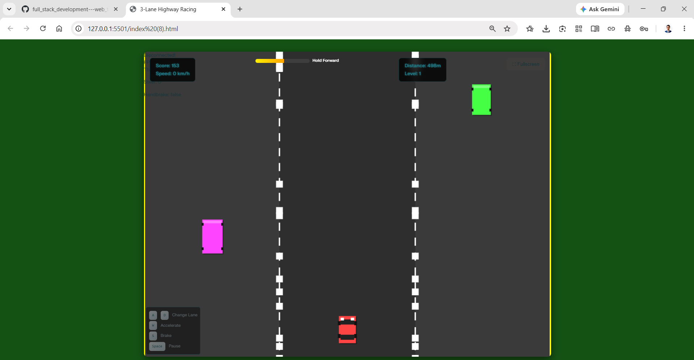

# 🌐 Full Stack Development Portfolio

<p align="center">
  
  
  
  
</p>

<p align="center">

<a href="#overview">Overview</a> •

<a href="#repository-structure">Repository Structure</a> •

<a href="#projects">Projects</a> •

<a href="#technology-stack">Technology Stack</a> •

<a href="#skills-demonstrated">Skills</a> •

<a href="#future-scope">Future Scope</a> •

<a href="#author">Author</a>

</p>

---

# Overview

This repository is a collection of full-stack web development projects developed during my learning journey.

The projects range from pure frontend applications to complete backend-driven systems built using **C++**, **PHP**, and **MySQL**.

Each project focuses on solving different real-world problems while demonstrating software architecture, UI development, backend programming, HTTP communication, database integration, authentication, and interactive web experiences.

Every project is documented individually with its own README containing architecture diagrams, installation instructions, screenshots, implementation details, and future enhancements.

---

# Repository Structure

```text
full_stack_development---web_technology/
│
├── README.md
│
├── Web_project_html_css_js/
│   ├── resume/
│   └── simple_truck_dealership_website/
│
├── web_project_cpp_backend/
│   ├── truck/
│   └── high_way_racing/
│
└── web_project_PHP_backend/
    └── swadghar_website_php_backend/
```

---

# Projects

# 1️⃣ HTML • CSS • JavaScript Projects

Frontend web applications developed using pure HTML, CSS and JavaScript without any external frameworks.

---

## 📄 Professional Resume Website

### Overview

A responsive single-page portfolio website designed to present professional information in a clean and recruiter-friendly format.

### Features

- Professional Resume
- Skills Section
- Education Timeline
- Project Portfolio
- Contact Information
- Responsive Design

### Preview

<p align="center">

</p>

Repository

```
Web_project_html_css_js/resume
```

---

## 🚚 GK Transports — Truck Dealership Website

### Overview

A commercial-style truck dealership website featuring product showcases, financing tools, comparison modules, and service booking interfaces.

### Features

- Product Gallery
- EMI Calculator
- Truck Comparison
- Accessories
- Contact Forms
- FAQ Section

### Preview

<p align="center">

</p>

Repository

```
Web_project_html_css_js/simple_truck_dealership_website
```

---

# 2️⃣ C++ Backend Projects

These projects combine frontend interfaces with backend systems developed in C++.

---

## 🚛 TruckHub

### Overview

A dealership platform where a static web frontend communicates with a C++ backend server implementing inventory management, EMI calculations, truck comparisons, and customer interactions.

### Features

- HTTP Backend
- JSON APIs
- EMI Calculator
- Truck Comparison
- Contact System

### Preview

<p align="center">

</p>

Repository

```
web_project_cpp_backend/truck
```

---

## 🏎️ 3-Lane Highway Racing Game

### Overview

An arcade racing game built using C++ and SFML demonstrating object-oriented programming, collision detection, procedural traffic generation, and game loop implementation.

### Features

- SFML Graphics
- Procedural Traffic
- Collision Detection
- Particle Effects
- Level System
- Score Tracking

### Preview

<p align="center">

</p>

Repository

```
web_project_cpp_backend/high_way_racing
```

---

# 3️⃣ PHP + MySQL Full Stack Project

---

## 🍽️ Swaad Ghar

### Overview

A restaurant management website built using PHP, MySQL, HTML, CSS, and JavaScript demonstrating authentication, database connectivity, session management, and dynamic web development.

### Features

- Login System
- Registration
- Contact Forms
- Recipe Website
- Blog
- Database Integration

### Preview

<p align="center">

</p>

Repository

```
web_project_PHP_backend/swadghar_website_php_backend
```

---

# Technology Stack

## Frontend

- HTML5
- CSS3
- JavaScript

## Backend

- C++
- PHP

## Database

- MySQL

## Libraries

- httplib
- SFML

## Development Tools

- Visual Studio Code
- XAMPP
- phpMyAdmin
- Git
- GitHub

---

# Skills Demonstrated

- Responsive Web Design
- Full Stack Development
- REST-style API Development
- Database Design
- Session Management
- Authentication
- Object-Oriented Programming
- HTTP Server Development
- Game Development
- Software Architecture
- UI/UX Design
- Client-Side JavaScript
- PHP Backend Development
- C++ Backend Programming

---

# Future Scope

This portfolio will continue expanding with additional projects including:

- Flask APIs
- Django Applications
- Docker Deployment
- CI/CD Pipelines
- Cloud Deployment
- Authentication Systems
- Microservices Architecture

---

# Author

**Krishna Ghute**

📧 Email

krishnavijayghute@gmail.com

💼 LinkedIn

https://www.linkedin.com/in/krishna-ghute-b72199370/

💻 GitHub

https://github.com/KrishnaGhute

📊 Kaggle

https://www.kaggle.com/krishnaghuteds

▶️ YouTube

https://www.youtube.com/@Krishna_Ghute

📸 Instagram

https://www.instagram.com/krishna_ghute_ds/

---

# License

No License.

---

<p align="center">

<strong>Full Stack Development Portfolio</strong>

A collection of frontend, backend, database-driven web applications, and C++ software projects showcasing practical software engineering, full-stack development, and modern programming concepts.

</p>
