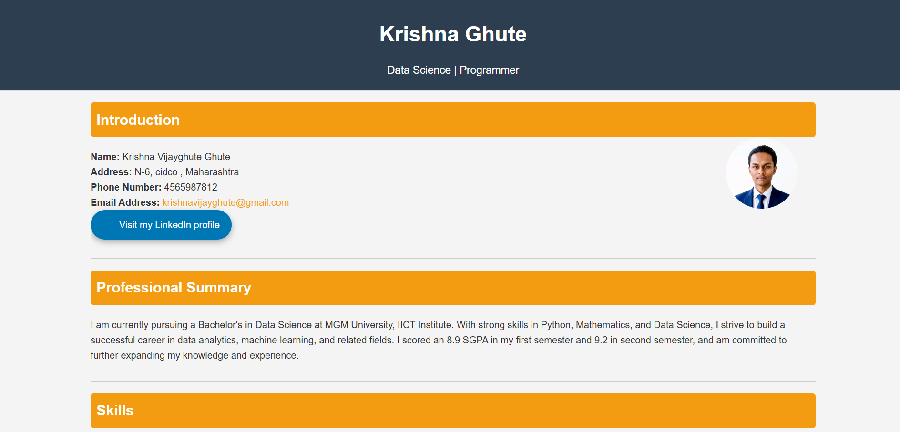

# Krishna Ghute | Personal Resume Web Page

<p align="center">
  
  
  
  
</p>

<p align="center">
  
</p>

## Overview

This repository contains a polished, single-page personal resume website built using HTML and CSS. The page presents the candidate’s professional identity, educational background, technical skills, project references, and contact information in a clean, recruiter-friendly layout.

The implementation is intentionally lightweight and dependency-free, making it easy to open and preview directly in a browser.

## Features

- Clean and professional one-page resume layout
- Candidate introduction and contact details
- Professional summary section
- Skills categorization for programming, technical, and soft skills
- Education timeline and academic performance details
- References section
- Project links to GitHub-based work samples
- Responsive layout styling for smaller screen sizes
- Embedded styling for easy portability

## Tech Stack

### Programming Languages
- HTML
- CSS

### Development Tools
- VS Code
- Modern web browser

## Architecture Diagram

> Placeholder for architecture diagram or system flow illustration.

```text
Browser
  └── web_resume.html
       └── Embedded CSS Styling
            └── Resume Sections + External Links
```

## Folder Structure

```text
resume/
├── web_resume.html
└── README.md
```

## Installation

No package installation is required.

1. Clone or download the repository.
2. Open the project folder.
3. Launch `web_resume.html` in a browser.

## Usage

After opening the HTML file in a browser, the resume page will render with all sections visible, including:

- personal profile summary
- academic record
- skill highlights
- project references
- LinkedIn profile button

## Screenshots

> Screenshot placeholder for the final resume page.


## Results

The project successfully delivers a presentation-ready resume page that can help showcase:

- academic achievements
- technical learning interests
- skill set
- professional contact information
- portfolio links

## Future Scope

Potential enhancements for the next version include:

- separating CSS into a dedicated stylesheet
- adding a downloadable PDF resume button
- adding smooth animations and transitions
- introducing a dark mode toggle
- deploying the page on GitHub Pages or Netlify
- adding better accessibility and semantic improvements

## Author

**Krishna Ghute**

- Email: krishnavijayghute@gmail.com

💼 LinkedIn
https://www.linkedin.com/in/krishna-ghute-b72199370/

▶️ YouTube
https://www.youtube.com/@Krishna_Ghute

📸 Instagram
https://www.instagram.com/krishna_ghute_ds/

📊 Kaggle
https://www.kaggle.com/krishnaghuteds

💻 GitHub
https://github.com/KrishnaGhute


## License

No license file was found in the repository. The repository currently does not declare a project license.

---

<p align="center">
  Built with HTML and CSS for a clean, professional, and recruiter-friendly resume presentation.
</p>
