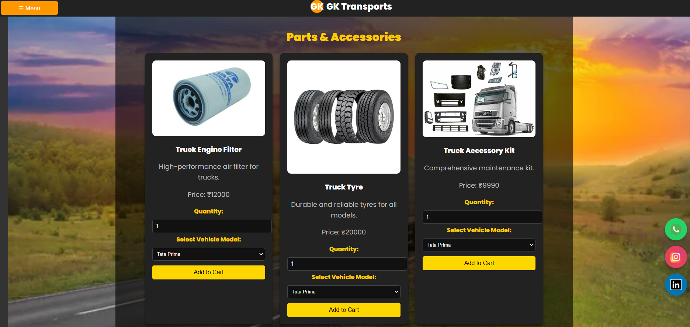
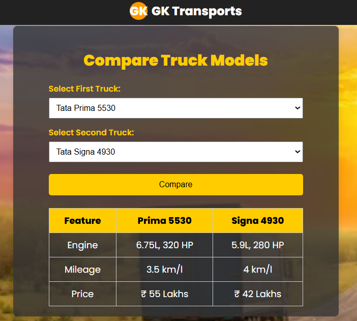
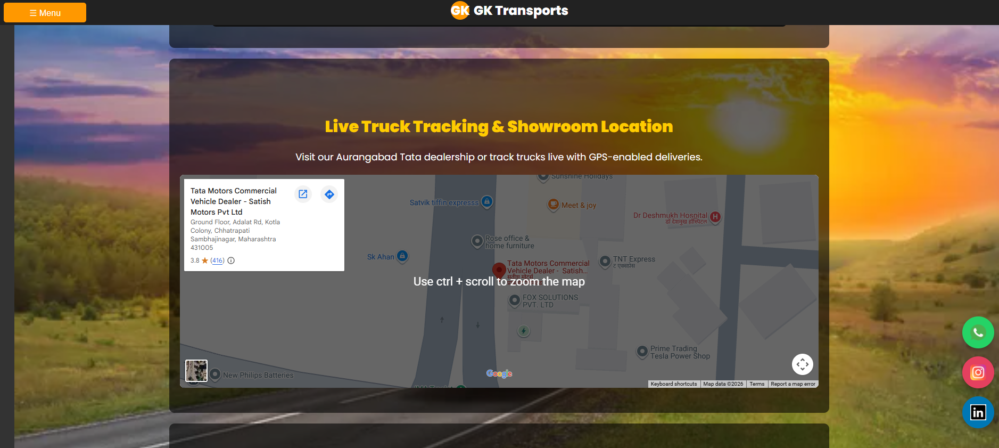

# GK Transports - Tata Truck Dealership Website

<p align="center">
  
  
  
  
  
</p>

<p align="center">
  
</p>

A responsive, customer-facing dealership website for showcasing Tata commercial trucks, finance estimates, service booking, and parts browsing through a polished static frontend experience.

## Overview

GK Transports is a dealership website prototype designed to present Tata truck models in a clean digital showroom format. The project focuses on product visibility, customer engagement, and lead-generation-style interactions through a single-page frontend interface.

The implementation is built using plain HTML, CSS, and JavaScript, with no backend or database layer. As a result, it serves as a frontend showcase and UX prototype rather than a full production commerce system.

## Features

- Interactive sidebar navigation
- Embedded YouTube introduction section
- Auto-scrolling truck gallery
- Detailed truck model cards with specifications and pricing
- Stock availability status table
- EMI calculator for financing estimation
- Truck comparison section
- Service booking form
- Parts and accessories gallery
- Client-side cart summary
- Installation booking section
- Embedded showroom map
- FAQ accordion
- Floating social action buttons for WhatsApp, Instagram, and LinkedIn

## Tech Stack

### Frontend
- HTML5
- CSS3
- Vanilla JavaScript

### External Integrations
- Google Fonts
- Google Maps Embed
- YouTube Embed
- External media assets from public image URLs

### Notes
- No framework is used.
- No backend service is present.
- No database is configured in the current repository.

### High-Level Flow

1. The user opens the website in a browser.
2. The HTML structure renders the dealership layout.
3. CSS controls styling and responsiveness.
4. JavaScript powers the interactive experience, including:
   - menu toggle
   - EMI calculation
   - cart logic
   - FAQ interaction
   - comparison output

## Folder Structure

```text
.
├── README.md
└── truck_dealer_website.html
```

### File Description

- `README.md` — repository documentation
- `truck_dealer_website.html` — the complete single-file frontend implementation containing markup, styles, and scripts

## Installation

### Prerequisites

- A modern web browser such as Chrome, Edge, Firefox, or Safari

### Steps

1. Clone or download the repository.
2. Open `truck_dealer_website.html` in your browser.
3. Optionally, serve it locally using:

```bash
python -m http.server 8000
```

Then visit:

```text
http://localhost:8000
```

## Usage

Once the page is opened:

1. Navigate between sections using the menu button.
2. Explore truck models and specifications.
3. Use the finance calculator to estimate monthly EMI.
4. Compare different models.
5. Add accessories to the cart.
6. Book service or installation.
7. Review location, FAQ, and contact information.

## Screenshots

### Home
<p align="center">
  
</p>

### Parts
<p align="center">
  
</p>

### Compare
<p align="center">
  
</p>

### Stock & Finance
<p align="center">
  
</p>


# Map
<p align="center">
  
</p>


## Results

This project delivers a clean and interactive dealership landing page experience with:

- strong visual branding
- customer-focused information flow
- static UI interactivity
- lead-generation style presentation

It is well-suited as a portfolio project, prototype, or educational frontend example.

## Future Scope

- Add a real backend for form submissions and inventory data
- Replace hardcoded demo content with a managed database
- Add user authentication for admin or dealership staff
- Integrate payment processing for accessories
- Introduce search, filters, and product sorting
- Deploy to GitHub Pages, Netlify, or Vercel
- Add analytics for traffic and lead tracking

## Author

GK Transports

## License

No license file was found in the repository. License information is currently not specified.

---

<p align="center">
  <strong>Built with HTML, CSS, and JavaScript for a polished dealership showcase experience.</strong>
</p>
