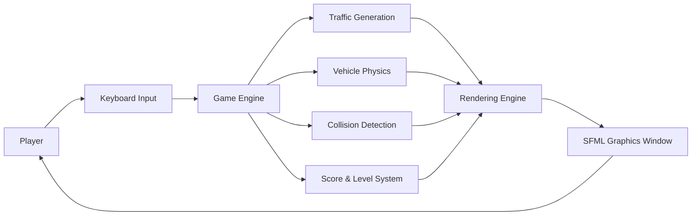

# 🏎️ 3-Lane Highway Racing Game

<p align="center">
  
  
  
  
</p>

<p align="center">
  <a href="#overview">Overview</a> •
  <a href="#features">Features</a> •
  <a href="#tech-stack">Tech Stack</a> •
  <a href="#installation">Installation</a> •
  <a href="#game-controls">Controls</a> •
  <a href="#future-scope">Future Scope</a>
</p>

---

# Project Banner

> Replace with your gameplay banner.

<p align="center">

</p>

---

# Overview

3-Lane Highway Racing Game is a desktop arcade racing game developed using **C++** and **SFML**.

The project simulates highway driving where players avoid dynamically generated traffic while increasing their score through distance travelled, vehicle avoidance, and speed bonuses.

The game demonstrates real-time game development concepts including collision detection, procedural traffic generation, game loops, particle effects, object-oriented programming, mathematical modelling, and responsive keyboard controls.

---

# Features

- 🚗 Three-lane highway system
- 🚛 Five unique vehicle categories
- 🎯 Dynamic collision detection
- ⚡ Progressive difficulty scaling
- 🎮 Smooth keyboard controls
- 🌟 Particle effects
- 📈 Score & Level system
- 🚦 Procedural traffic generation
- 🧮 Mathematical vehicle spawning
- 💥 Crash animation effects
- 🎵 SFML multimedia support
- 🖥️ Native desktop performance

---

# Tech Stack

## Programming Language

- C++17

## Libraries

- SFML Graphics
- SFML Window
- SFML Audio
- SFML System

## Development Tools

- Visual Studio Code
- GCC / G++
- Makefile

## Platform

- Windows
- Linux
- macOS

---

# Architecture Diagram



---

# Folder Structure

```text
3-lane-highway-racing/

├── README.md
├── LICENSE
├── Makefile
├── highway_racing.cpp
├── assets/
│   ├── car.png
│   ├── truck.png
│   ├── road.png
│   └── particles/
├── photo/
│   ├── home.png
│   ├── gameplay.png
│   ├── gameover.png
│   └── banner.png
```

---

# Installation

## Prerequisites

- C++17 Compiler
- SFML 2.5+
- Make

---

## Build

Ubuntu

```bash
sudo apt install libsfml-dev

make
```

Windows

Configure SFML libraries inside Visual Studio or CodeBlocks and build the project.

---

## Run

```bash
./highway_racing
```

---

# Game Controls

| Key | Action |
|------|--------|
| ← | Move Left |
| → | Move Right |
| ↑ | Accelerate |
| ↓ | Brake |
| Space | Pause |
| R | Restart |
| ESC | Exit |

---

# Gameplay

The objective is to survive as long as possible by avoiding incoming vehicles.

The player gains points by

- Travelling longer distance
- Maintaining higher speed
- Successfully overtaking traffic
- Reaching higher levels

As the level increases

- Traffic density increases
- Vehicle speed increases
- Spawn frequency increases
- Difficulty becomes more challenging

---

# Game Mechanics

## Vehicle Types

- Compact Cars
- Sedans
- SUVs
- Sports Cars
- Heavy Trucks

Each vehicle has different

- Speed
- Size
- Spawn probability
- Score value

---

# Mathematical Model

Traffic generation follows weighted probability.

```
Spawn Rate

↓

Vehicle Selection

↓

Lane Selection

↓

Collision Safety Check

↓

Spawn Vehicle
```

Difficulty scaling is based on

- Current Level
- Player Speed
- Distance Travelled

---

# Screenshots

## Home Screen


---

## Gameplay


---

## Game Over


---

# Results

The project demonstrates

- Object-Oriented Programming
- Real-time Game Loop
- SFML Graphics Programming
- Collision Detection
- Mathematical Traffic Simulation
- Keyboard Event Handling
- Procedural Content Generation
- Desktop Game Development

---

# Future Scope

Possible improvements

- Multiplayer Mode
- Online Leaderboard
- Garage System
- Vehicle Upgrades
- Weather Effects
- Night Mode
- AI Opponent Vehicles
- Soundtrack
- Multiple Maps
- Save Game Feature

---

# Author

**Krishna Ghute**

💼 LinkedIn

https://www.linkedin.com/in/krishna-ghute-b72199370/

💻 GitHub

https://github.com/KrishnaGhute

📊 Kaggle

https://www.kaggle.com/krishnaghuteds

📸 Instagram

https://www.instagram.com/krishna_ghute_ds/

▶️ YouTube

https://www.youtube.com/@Krishna_Ghute

---

# License

This project is intended for educational and portfolio purposes.

See the **LICENSE** file for usage terms.

---

<p align="center">

**3-Lane Highway Racing Game**

Designed using **C++**, **SFML**, and modern game programming principles.

</p>