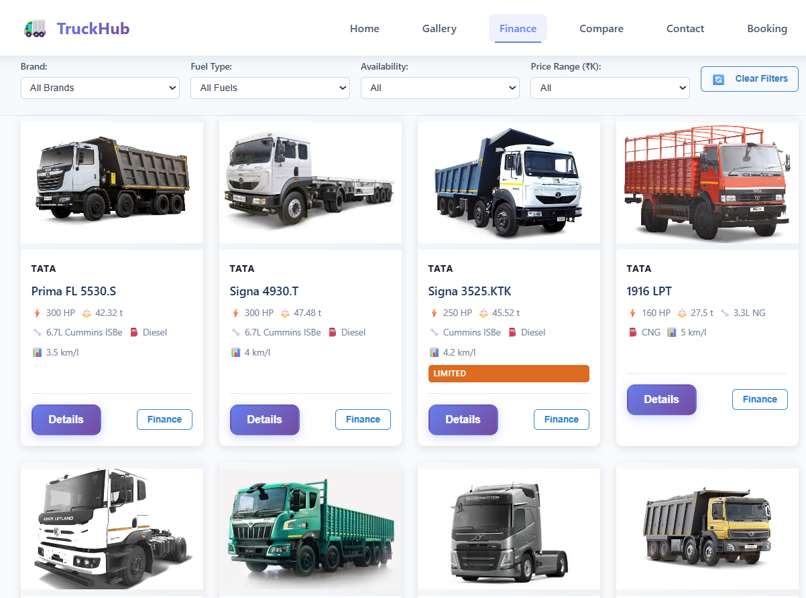
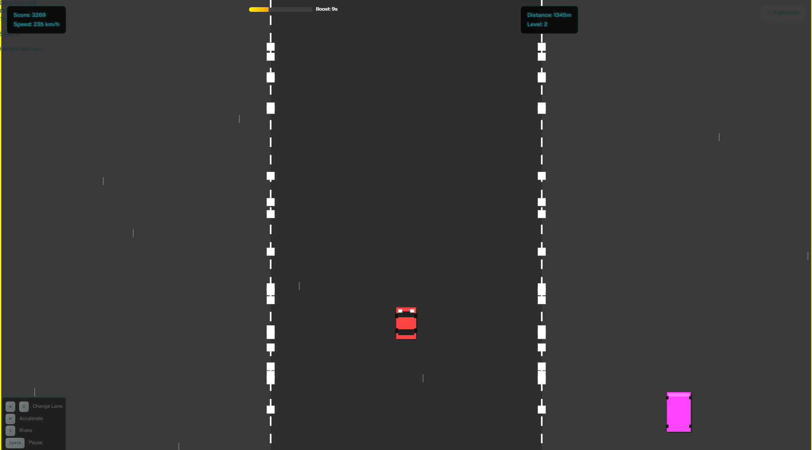

# 💻 C++ Development Portfolio

<p align="center">
  
  
  
  
</p>

<p align="center">
  <a href="#overview">Overview</a> ·
  <a href="#projects-included">Projects</a> ·
  <a href="#common-tech-stack">Tech Stack</a> ·
  <a href="#repository-structure">Repository Structure</a> ·
  <a href="#future-scope">Future Scope</a> ·
  <a href="#author">Author</a>
</p>

---

# Overview

This repository serves as a collection of C++ projects developed to demonstrate software engineering concepts, object-oriented programming, backend development, and desktop application development.

The projects showcase practical implementations ranging from HTTP backend systems to real-time game development using modern C++ libraries. Each project is maintained in its own folder with detailed documentation and source code.

---

# Projects Included

## 🚛 TruckHub

### Overview

TruckHub is a dealership-style web application that combines a responsive frontend with a C++ backend. The project demonstrates how C++ can be used to power REST-style APIs for inventory management, vehicle comparison, finance calculations, and customer interactions.

### Preview

<p align="center">

</p>

### Key Features

- Responsive dealership website
- C++ HTTP backend
- Truck inventory management
- Finance & EMI calculator
- Truck comparison system
- Contact handling
- JSON API endpoints
- Lightweight backend architecture

### Technologies Used

- C++17
- httplib.h
- HTML5
- CSS3
- JavaScript

---

## 🏎️ 3-Lane Highway Racing Game

### Overview

A desktop arcade racing game developed using C++ and SFML that focuses on real-time rendering, procedural traffic generation, collision detection, and object-oriented game development.

### Preview

<p align="center">

</p>

### Key Features

- Three-lane highway racing
- Procedural traffic generation
- Multiple vehicle categories
- Dynamic difficulty progression
- Collision detection
- Particle effects
- Score & level system
- Cross-platform desktop support

### Technologies Used

- C++17
- SFML
- Makefile
- Object-Oriented Programming

---

# Common Tech Stack

## Programming Languages

- C++
- C++17

## Libraries

- SFML
- httplib.h

## Frontend Technologies

- HTML5
- CSS3
- JavaScript

## Development Tools

- Visual Studio Code

---

# Repository Structure

```text
web_project_cpp_backend/
│
├── README.md
│
├── truck/
│   ├── README.md
│   └── ...
│
└── high_way_racing/
    ├── README.md
    └── ...
```

---

# Future Scope

### TruckHub

- Database integration
- Authentication system
- Admin dashboard
- Cloud deployment
- Docker support
- Inventory analytics

### 3-Lane Highway Racing Game

- AI-controlled traffic
- Multiplayer mode
- Weather effects
- New maps
- Leaderboard system
- Soundtrack and advanced visual effects

---

# Author

**Krishna Ghute**

📧 Email

krishnavijayghute@gmail.com

💼 LinkedIn

https://www.linkedin.com/in/krishna-ghute-b72199370/

💻 GitHub

https://github.com/KrishnaGhute

📊 Kaggle

https://www.kaggle.com/krishnaghuteds

▶️ YouTube

https://www.youtube.com/@Krishna_Ghute

📸 Instagram

https://www.instagram.com/krishna_ghute_ds/

---

# License
License for Car game read **LICENSE** file.

No license specified for truck delear website.

These projects are shared for portfolio and educational purposes.

---

<p align="center">
<strong>C++ Development Portfolio</strong><br>
A collection of C++ projects showcasing backend development, game development, object-oriented programming, and software engineering concepts.
</p>
