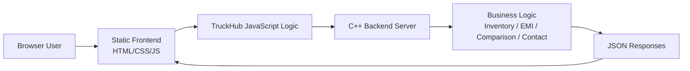
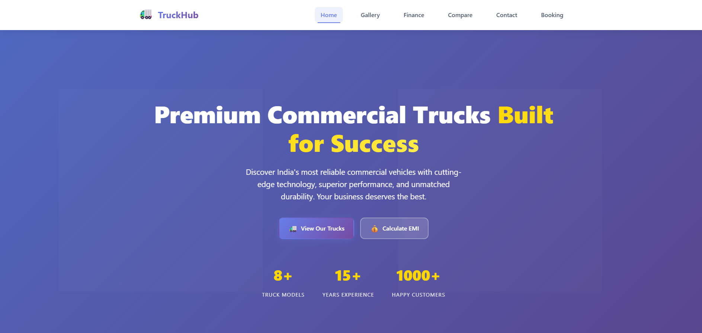
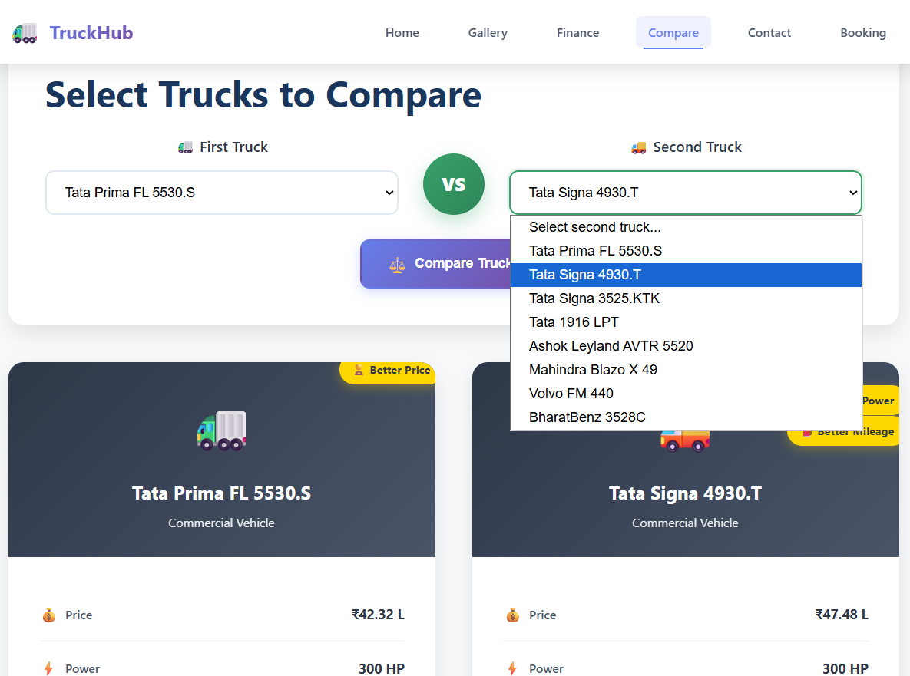
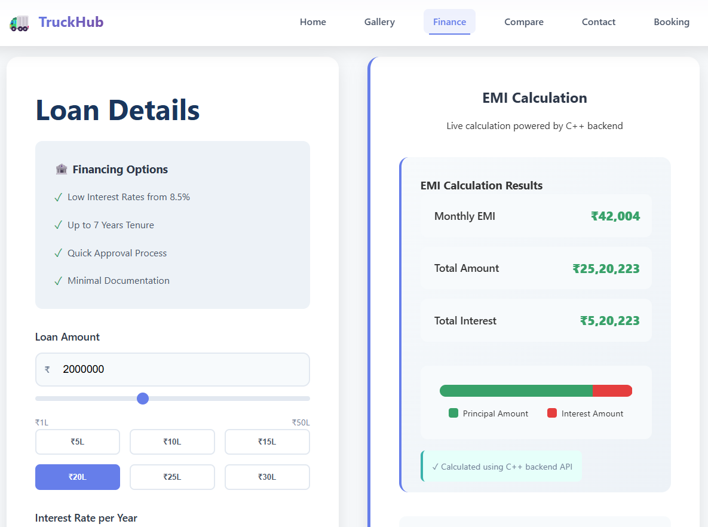
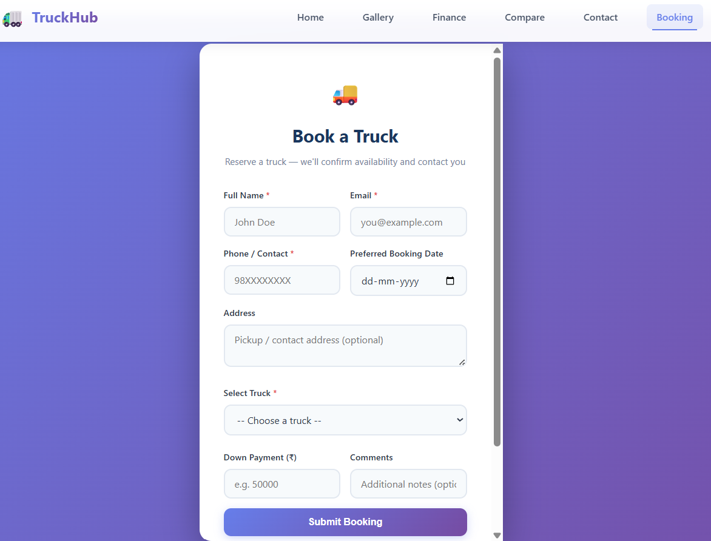
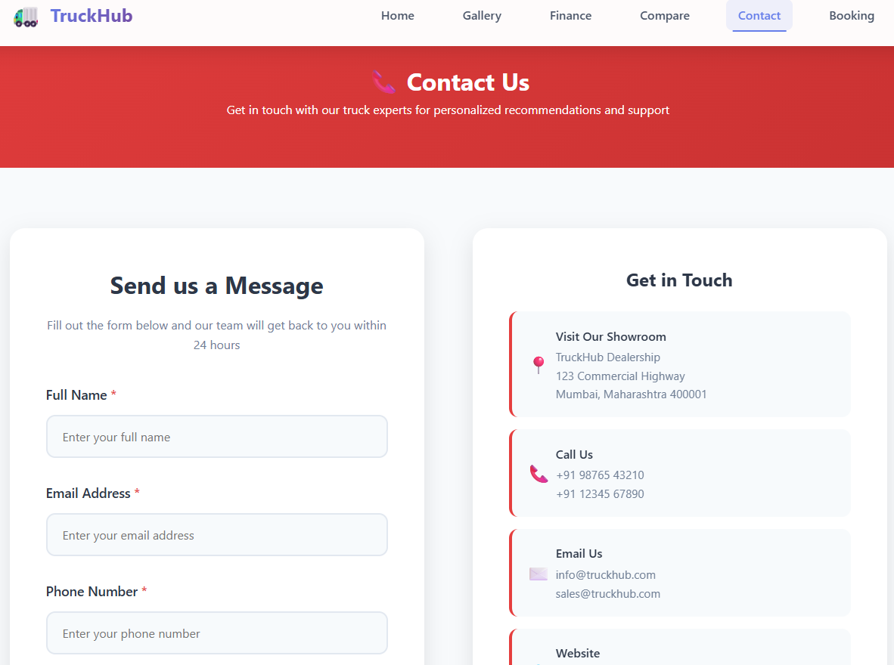

# TruckHub 🚛

<p align="center">
  
  
  
  
</p>

<p align="center">
  <a href="#overview">Overview</a> ·
  <a href="#features">Features</a> ·
  <a href="#tech-stack">Tech Stack</a> ·
  <a href="#installation">Installation</a> ·
  <a href="#usage">Usage</a>
</p>

## Project Banner

> Placeholder for a project banner or hero image.


## Overview

TruckHub is a dealership-style web project that demonstrates a static frontend connected to a C++ backend. The repository contains a multi-page truck dealership website, a C++ server implementing inventory and business logic, and a lightweight JSON API layer for truck browsing, EMI calculation, comparison, and contact processing.

This project is best understood as a prototype or learning-oriented application rather than a production-ready commercial platform.

## Features

- Responsive multi-page dealership frontend
- Gallery-based truck browsing experience
- Finance and EMI calculation workflow
- Truck comparison logic with recommendation output
- Contact submission handling
- In-memory truck inventory dataset
- JSON API endpoints powered by a C++ HTTP backend

## Tech Stack

### Programming Languages
- C++
- HTML
- CSS
- JavaScript

### Frameworks
- No dedicated framework is configured in the repository.

### Libraries
- `httplib.h` for lightweight HTTP server support

### Databases
- No database implementation was found in the repository.

### APIs
- `/getTrucks`
- `/calculateEMI`
- `/compare`
- `/contact`
- `/getAvailability`

### Deployment Platforms
- No deployment configuration or cloud platform files were found.

### Development Tools
- Visual Studio C++ workspace settings
- Browser-based frontend development
- C++ compiler toolchain

## Architecture Diagram



## Folder Structure

```text
truck/
├── README.md
├── httplib.h
├── truck_dealership_backend.cpp
├── truck_dealership_server.exe
└── truck_frontend/
    ├── index.html
    ├── gallery.html
    ├── finance.html
    ├── compare.html
    ├── contact.html
    ├── signup.html
    ├── script.js
    ├── booking.js
    └── styles.css
```

### Folder Details

- `truck_frontend/` – static website pages and frontend assets
- `truck_dealership_backend.cpp` – main C++ backend and HTTP endpoint implementation
- `httplib.h` – HTTP library header used by the backend
- `truck_dealership_server.exe` – compiled Windows executable

## Installation

### Prerequisites

- A C++ compiler such as `g++` or Visual Studio C++ tools
- A browser for viewing the frontend pages

### Build the Backend

From the project root, compile the C++ server with:

```bash
g++ -std=c++17 -O2 -o truck_backend truck_dealership_backend.cpp -lpthread
```

### Run the Backend

```bash
./truck_backend
```

The backend listens on port `8080` and serves JSON endpoints for the frontend.

## Usage

1. Start the C++ backend server.
2. Open the frontend pages from `truck_frontend/` in a browser.
3. Browse trucks, calculate EMI, compare models, or submit contact requests.

### Example

```bash
# Compile backend
g++ -std=c++17 -O2 -o truck_backend truck_dealership_backend.cpp -lpthread

# Run backend
./truck_backend
```

## Screenshots

> Screenshots section placeholder. Add actual UI screenshots here for a more polished repository presentation.

### Home


### Gallery


### Compare


### Loan & EMI Calculator


### Booking


### Contact


## Results

The project demonstrates the following outcomes:

- A clean dealership-style frontend with multiple pages
- C++-based business logic for truck inventory and customer workflows
- JSON API response handling for frontend consumption
- A prototype architecture suitable for portfolio and learning demonstrations

## Future Scope

Potential future enhancements include:

- Replacing simulated frontend API responses with fully wired live requests
- Adding persistent storage for bookings and contact data
- Introducing a real database layer
- Adding admin inventory management
- Improving deployment automation and containerization
- Expanding the UI into a full commercial dealership platform

## Author

**Krishna Ghute**

- Email: krishnavijayghute@gmail.com

💼 LinkedIn
https://www.linkedin.com/in/krishna-ghute-b72199370/

▶️ YouTube
https://www.youtube.com/@Krishna_Ghute

📸 Instagram
https://www.instagram.com/krishna_ghute_ds/

📊 Kaggle
https://www.kaggle.com/krishnaghuteds

💻 GitHub
https://github.com/KrishnaGhute

## License

No license file was found in the repository. Please add an appropriate open-source license before public distribution.

---

<p align="center">
  <strong>TruckHub</strong> · Designed for dealership demos, C++ backend exploration, and portfolio presentation.
</p>
