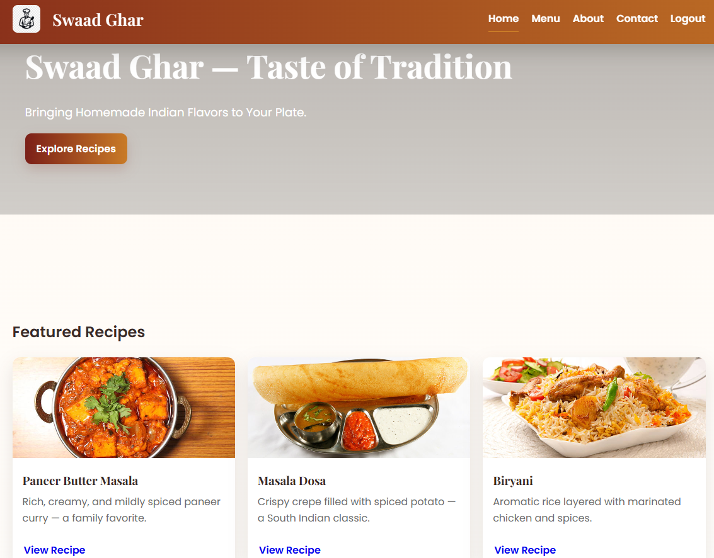
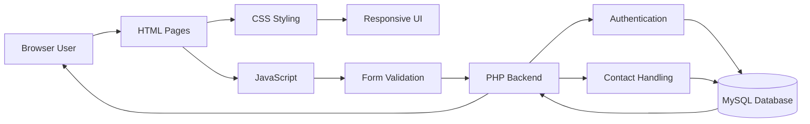
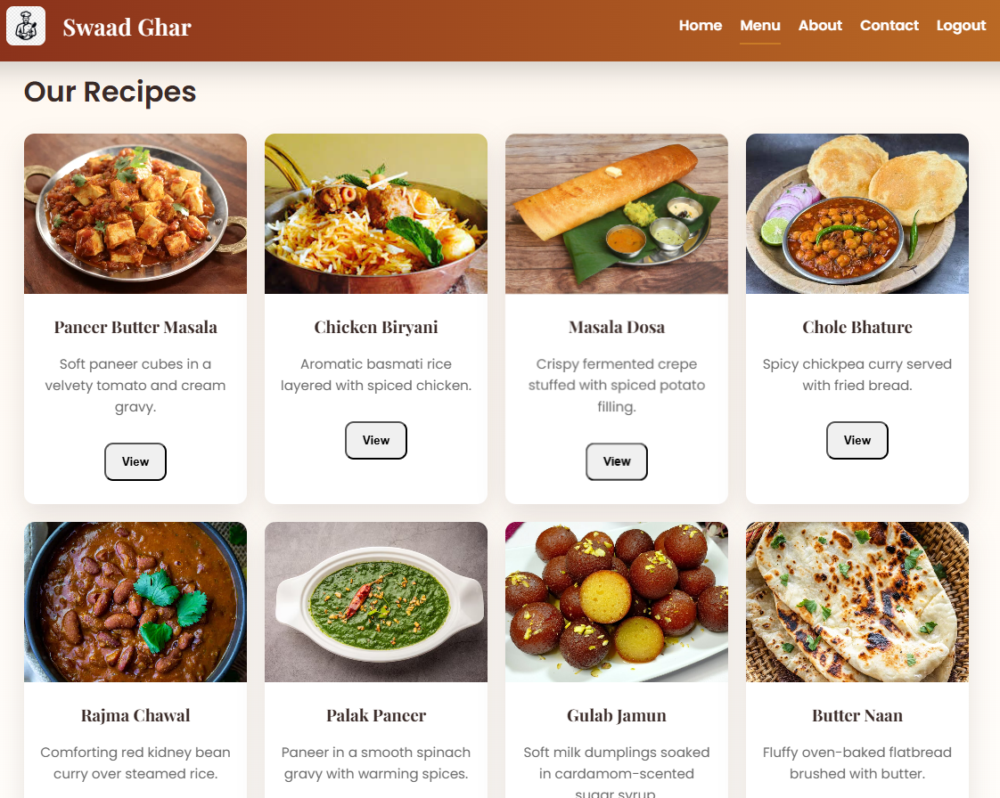
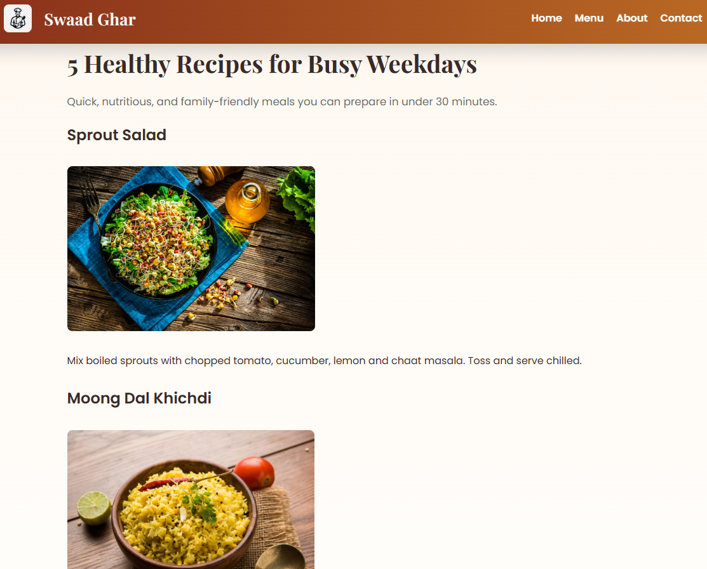
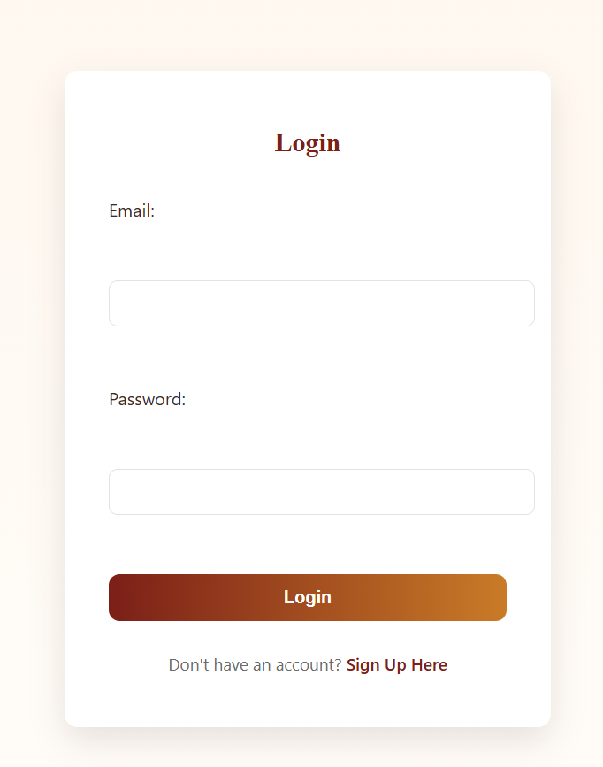
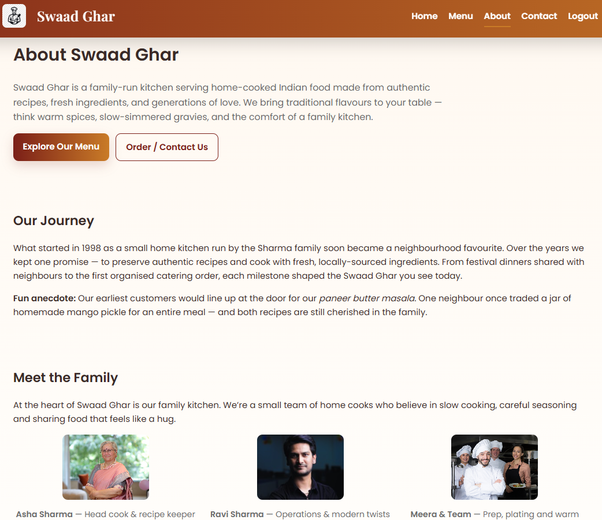
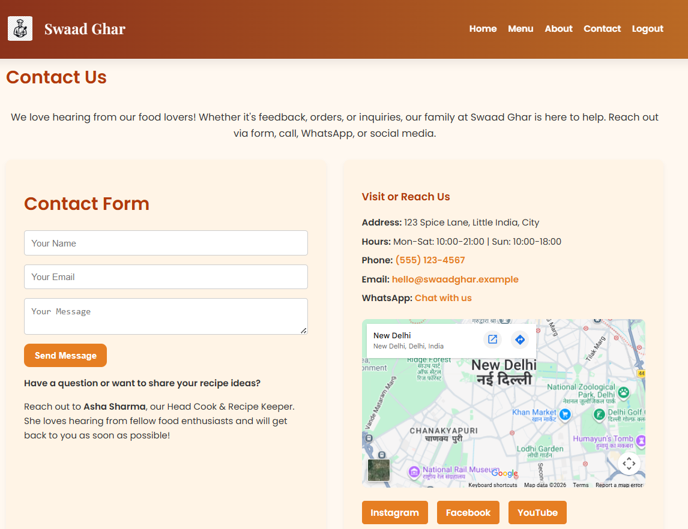

# 🍽️ Swaad Ghar

<p align="center">
  
  
  
  
</p>

<p align="center">
  <a href="#overview">Overview</a> ·
  <a href="#features">Features</a> ·
  <a href="#tech-stack">Tech Stack</a> ·
  <a href="#architecture-diagram">Architecture</a> ·
  <a href="#folder-structure">Folder Structure</a> ·
  <a href="#installation">Installation</a> ·
  <a href="#usage">Usage</a>
</p>

---

# Overview

Swaad Ghar is a restaurant and recipe management website developed using **PHP, MySQL, HTML, CSS, and JavaScript**. The project demonstrates the fundamentals of full-stack web development by integrating a responsive frontend with a PHP backend and MySQL database.

The application allows users to explore recipes, browse blogs, submit contact forms, and register or log into the platform using a session-based authentication system.

---

## Project Banner

> Placeholder for a project banner or hero image.




# Features

- Responsive restaurant landing page
- Interactive recipe catalog
- Food blog pages
- User Registration
- User Login & Logout
- Session-based Authentication
- Contact Form
- MySQL Database Integration
- Client-side Form Validation
- Responsive User Interface

---

# Tech Stack

## Frontend

- HTML5
- CSS3
- JavaScript

## Backend

- PHP

## Database

- MySQL

## Server Environment

- Apache (XAMPP)

## Development Tools

- Visual Studio Code
- phpMyAdmin
- XAMPP

---

# Architecture Diagram



---

# Folder Structure

```text
swadghar_website_php_backend/

├── README.md
│
├── menu/
│   ├── home.php
│   ├── index.html
│   ├── menu.html
│   ├── about.html
│   ├── contact.html
│   ├── contact.php
│   ├── blog1.html
│   ├── blog2.html
│   ├── script.js
│   ├── style.css
│   └── styles.css
│
└── mywebsite/
    ├── assets/
    ├── database.php
    ├── signin.html
    ├── signup.html
    ├── signin_process.php
    ├── signup_process.php
    └── logout.php
```

---

# Installation

## Prerequisites

- XAMPP
- Apache
- MySQL
- PHP
- Modern Web Browser

---

## Setup

Clone the repository

```bash
git clone <repository-url>
```

Move the project into the XAMPP `htdocs` directory.

Start

- Apache
- MySQL

Create the required MySQL database and tables.

Update database credentials inside

```text
database.php
```

Open

```text
http://localhost/menu/
```

---

# Database Schema

### Users

```sql
CREATE TABLE users (
    id INT AUTO_INCREMENT PRIMARY KEY,
    email VARCHAR(255) NOT NULL,
    password VARCHAR(255) NOT NULL
);
```

### Contacts

```sql
CREATE TABLE contacts (
    id INT AUTO_INCREMENT PRIMARY KEY,
    name VARCHAR(255),
    email VARCHAR(255),
    message TEXT,
    created_at TIMESTAMP DEFAULT CURRENT_TIMESTAMP
);
```

---

# Usage

### Visitor

- Browse recipes
- Read blogs
- Explore restaurant pages
- Submit contact form

### Registered User

- Create account
- Login securely
- Logout using session management

---

# Screenshots

### Home Page


---

### Recipe Menu



---

### Blog



---

### Login Page



---

### About Page



---

### Contact Page



---

# Results

The project demonstrates:

- PHP-based backend development
- MySQL database connectivity
- Session management
- User authentication
- Form handling
- Responsive web design
- Full-stack web development fundamentals

---

# Future Scope

- Admin Dashboard
- Food Ordering System
- Online Table Reservation
- Payment Gateway Integration
- Email Notifications
- Recipe Management System
- MVC Architecture
- Cloud Deployment

---

# Author

**Krishna Ghute**

📧 Email

krishnavijayghute@gmail.com

💼 LinkedIn

https://www.linkedin.com/in/krishna-ghute-b72199370/

💻 GitHub

https://github.com/KrishnaGhute

📊 Kaggle

https://www.kaggle.com/krishnaghuteds

▶️ YouTube

https://www.youtube.com/@Krishna_Ghute

📸 Instagram

https://www.instagram.com/krishna_ghute_ds/

---

# License

No license specified.

This project is shared for educational and portfolio purposes.

---

<p align="center">
<strong>Swaad Ghar</strong><br>
A PHP & MySQL based restaurant website demonstrating full-stack web development, user authentication, and database-driven web applications.
</p>
